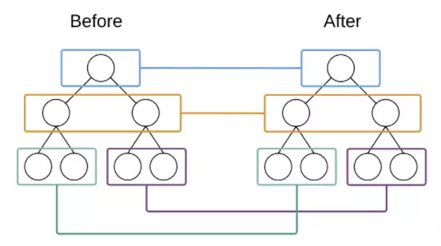
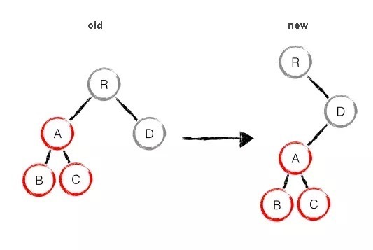
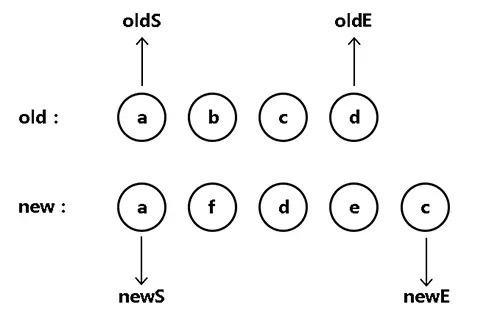

# diff算法
我们知道直接操作真实`DOM`对于性能的开销是非常大的，我们修改某个数据，如果直接渲染到真实`DOM`会引起整个`DOM`树的重绘重排。如果使用虚拟`DOM`生成一棵`virtual DOM`，当`virtual DOM`中的某个节点改变的时候会生成一个新的`VNode`，然后拿这个新的`VNode`和`oldVnode`进行比较，发现不一样的直接修改在真实`DOM`上，然后使oldVnode的值为Vnode。diff的过程就是调用名为patch的函数，比较新旧节点，一边比较一边给真实的DOM打补丁。

# diff算法三大策略

* Tree Diff
* Component Diff
* Element Diff

三种策略的执行顺序也是顺序依次执行。

## Tree Diff



`Tree Diff`是对树的每一层进行比较，这个比较只会发生在同级元素。如图所示。

## Component Diff

是数据层面的差异比较
* 如果都是同一类型的组件(即：两节点是同一个组件类的两个不同实例，比如：<div id="before"></div>与<div id="after"></div>)，按照原策略继续比较Virtual DOM树即可
* 如果是不同类型的组件那么将替换组件下的所有子节点。


## Element Diff
真实DOM渲染，结构差异的比较

首先进行第一层比较，第一层都是R，不发生变化；然后进入第二层Component Diff，发现A组件没有，则删除A及其子组件B、C；最后比较第三层，创建A及其子组件B、C。

在同一层级中`Diff`会进行三种`DOM`操作： **删除、移动、插入**

首先看`patch`的源码：
```javascript
function patch (oldVnode, vnode) {
    // some code
    if (sameVnode(oldVnode, vnode)) {
        patchVnode(oldVnode, vnode)
    } else {
        const oEl = oldVnode.el // 当前oldVnode对应的真实元素节点
        let parentEle = api.parentNode(oEl)  // 父元素
        createEle(vnode)  // 根据Vnode生成新元素
        if (parentEle !== null) {
            api.insertBefore(parentEle, vnode.el, api.nextSibling(oEl)) // 将新元素添加进父元素
            api.removeChild(parentEle, oldVnode.el)  // 移除以前的旧元素节点
            oldVnode = null
        }
    }
    // some code
    return vnode
}

patchVnode (oldVnode, vnode) {
    const el = vnode.el = oldVnode.el
    let i, oldCh = oldVnode.children, ch = vnode.children
    if (oldVnode === vnode) return
    if (oldVnode.text !== null && vnode.text !== null && oldVnode.text !== vnode.text) {
        api.setTextContent(el, vnode.text)
    }else {
        updateEle(el, vnode, oldVnode)
        if (oldCh && ch && oldCh !== ch) {
            updateChildren(el, oldCh, ch)
        }else if (ch){
            createEle(vnode) //create el's children dom
        }else if (oldCh){
            api.removeChildren(el)
        }
    }
}
```
* 找到对应的真实dom，称为el
* 判断Vnode和oldVnode是否指向同一个对象，如果是，那么直接return
* 如果他们都有文本节点并且不相等，那么将el的文本节点设置为Vnode的文本节点。
* 如果oldVnode有子节点而Vnode没有，则删除el的子节点
* 如果oldVnode没有子节点而Vnode有，则将Vnode的子节点真实化之后添加到el
* 如果两者都有子节点，则执行updateChildren函数比较子节点

```javascript
function updateChildren (parentElm, oldCh, newCh, insertedVnodeQueue, removeOnly) {
    var oldStartIdx = 0;
    var newStartIdx = 0;
    var oldEndIdx = oldCh.length - 1;
    var oldStartVnode = oldCh[0];
    var oldEndVnode = oldCh[oldEndIdx];
    var newEndIdx = newCh.length - 1;
    var newStartVnode = newCh[0];
    var newEndVnode = newCh[newEndIdx];
    var oldKeyToIdx, idxInOld, vnodeToMove, refElm;

    var canMove = !removeOnly;
    {
        checkDuplicateKeys(newCh);
    }
    // oldVnode起始位置小于结束位置并且newVnode起始位置小于结束位置
    while (oldStartIdx <= oldEndIdx && newStartIdx <= newEndIdx) {
        // isUndef 用来判断对象是否等于undefined或者为空，是的话返回true
        if (isUndef(oldStartVnode)) {
            // oldVnode 起始位置oldS++
            oldStartVnode = oldCh[++oldStartIdx]; // Vnode has been moved left
        } else if (isUndef(oldEndVnode)) {
            // oldVnode 结束位置oldE--
            oldEndVnode = oldCh[--oldEndIdx];
        } else if (sameVnode(oldStartVnode, newStartVnode)) {
            // oldS和newS相同，不变化，进行patch，oldS++，newS++
            patchVnode(oldStartVnode, newStartVnode, insertedVnodeQueue, newCh, newStartIdx);
            oldStartVnode = oldCh[++oldStartIdx];
            newStartVnode = newCh[++newStartIdx];
        } else if (sameVnode(oldEndVnode, newEndVnode)) {
            // oldE和newE相同，不变化，进行patch，oldE--，newE--
            patchVnode(oldEndVnode, newEndVnode, insertedVnodeQueue, newCh, newEndIdx);
            oldEndVnode = oldCh[--oldEndIdx];
            newEndVnode = newCh[--newEndIdx];
        } else if (sameVnode(oldStartVnode, newEndVnode)) { // Vnode moved right
            // oldS和newE相同，oldS移动到oldE之后，进行patch，oldS++，newE--
            patchVnode(oldStartVnode, newEndVnode, insertedVnodeQueue, newCh, newEndIdx);
            canMove && nodeOps.insertBefore(parentElm, oldStartVnode.elm, nodeOps.nextSibling(oldEndVnode.elm));
            oldStartVnode = oldCh[++oldStartIdx];
            newEndVnode = newCh[--newEndIdx];
        } else if (sameVnode(oldEndVnode, newStartVnode)) { // Vnode moved left
            // oldE和newS相同，oldE移动到oldS之前，进行patch，oldE--，newS++
            patchVnode(oldEndVnode, newStartVnode, insertedVnodeQueue, newCh, newStartIdx);
            canMove && nodeOps.insertBefore(parentElm, oldEndVnode.elm, oldStartVnode.elm);
            oldEndVnode = oldCh[--oldEndIdx];
            newStartVnode = newCh[++newStartIdx];
        } else {
            // 全都不相同情况下
            // 获取oldVnode->index的key
            if (isUndef(oldKeyToIdx)) {
                oldKeyToIdx = createKeyToOldIdx(oldCh, oldStartIdx, oldEndIdx);
            }
            idxInOld = isDef(newStartVnode.key)
              ? oldKeyToIdx[newStartVnode.key]
              : findIdxInOld(newStartVnode, oldCh, oldStartIdx, oldEndIdx);
            if (isUndef(idxInOld)) { // New element
                // oldVnode->index为undefined或null，说明没有该元素，创建新的元素
                createElm(newStartVnode, insertedVnodeQueue, parentElm, oldStartVnode.elm, false, newCh, newStartIdx);
            } else {
                  // 获取oldVnode
                  vnodeToMove = oldCh[idxInOld];
                  if (sameVnode(vnodeToMove, newStartVnode)) {
                      // 创建的Vnode和newS相同，插入到oldS之前，进行patch
                      patchVnode(vnodeToMove, newStartVnode, insertedVnodeQueue, newCh, newStartIdx);
                      oldCh[idxInOld] = undefined;
                      canMove && nodeOps.insertBefore(parentElm, vnodeToMove.elm, oldStartVnode.elm);
                  } else {
                      // 相同的key但是不一样的element. 被视为新的element
                      createElm(newStartVnode, insertedVnodeQueue, parentElm, oldStartVnode.elm, false, newCh, newStartIdx);
                  }
            }
            newStartVnode = newCh[++newStartIdx];
        }
    }
    // 当oldS>oldE时，将newS至newE间的全部插入
    if (oldStartIdx > oldEndIdx) {
        refElm = isUndef(newCh[newEndIdx + 1]) ? null : newCh[newEndIdx + 1].elm;
        addVnodes(parentElm, refElm, newCh, newStartIdx, newEndIdx, insertedVnodeQueue);
    } else if (newStartIdx > newEndIdx) {
        // 当newS>newE，将oldS至oldE间的全部删除
        removeVnodes(parentElm, oldCh, oldStartIdx, oldEndIdx);
    }
}
```
`updateChildren`函数实际就是执行了以下操作：

现在分别对oldS、oldE、S、E两两做sameVnode比较，有四种比较方式

* 如果是oldS和E匹配上了，那么真实dom中的第一个节点会移到最后
* 如果是oldE和S匹配上了，那么真实dom中的最后一个节点会移到最前，匹配上的两个指针向中间移动
* 如果四种匹配没有一对是成功的，那么遍历oldChild，S挨个和他们匹配，匹配成功就在真实dom中将成功的节点移到最前面，如果依旧没有成功的，那么将S对应的节点插入到dom中对应的oldS位置，oldS和S指针向中间移动

第一步：
> oldS = a, oldE = d；
> newS = a, newE = c;

oldS和newS的值那么保持不变，oldS++和newS++，向中间移动。

第二步：
>oldS = b,oldE = d;
>newS = f,newE = c;

newS与OldVnode所有元素都不匹配，oldS前面插入f，newS++。

第三步:
>oldS = b，oldE = d
>newS = d， newE = c

oldE和newS相等，把oldE移动到oldS的前面，newS++，oldE--

第四步：
>oldS = b，oldE = c
>newS = e， newE = c

newE与oldE相同，不发生变化，newE--，oldE--。

第五步：
>oldS = b，oldE = b
>newS = e， newE = e

都不相同，oldS前插入newE，删除oldS，oldS++，newS++，newE--，oldE--。

第六步：
oldS > oldE，Diff结束，最后结果为：a、f、d、e、c。

这个匹配过程的结束有两个条件：

* oldS > oldE表示old先遍历完，那么就将多余的节点根据index添加到dom中去
* newS > newE表示new先遍历完，那么就在真实dom中将区间为[oldS, oldE]的多余节点删掉
