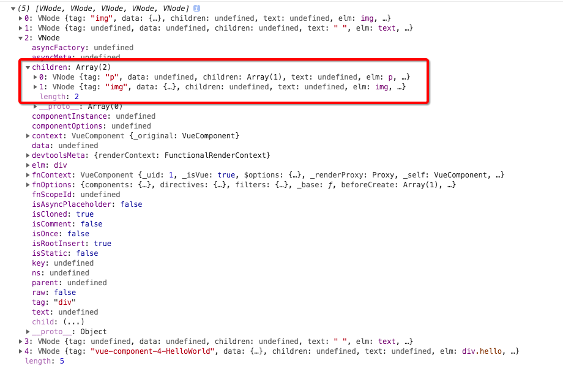

# VNode的创建
render方法其实就是一个创建VNode的过程，它会调用
`vm.$createElement`方法在`render.js`文件有定义
```javascript
// bind the createElement fn to this instance
// so that we get proper render context inside it.
// args order: tag, data, children, normalizationType, alwaysNormalize
// internal version is used by render functions compiled from templates
vm._c = (a, b, c, d) => createElement(vm, a, b, c, d, false)
// normalization is always applied for the public version, used in
// user-written render functions.
vm.$createElement = (a, b, c, d) => createElement(vm, a, b, c, d, true)
```
`createElement`方法。它定义在 `src/core/vdom/create-elemenet.js` 中：
```javascript
export function createElement (
  context: Component,
  tag: any,
  data: any,
  children: any,
  normalizationType: any,
  alwaysNormalize: boolean
): VNode | Array<VNode> {
  if (Array.isArray(data) || isPrimitive(data)) {
    normalizationType = children
    children = data
    data = undefined
  }
  if (isTrue(alwaysNormalize)) {
    normalizationType = ALWAYS_NORMALIZE
  }
  return _createElement(context, tag, data, children, normalizationType)
}
```
`createElement`方法核心是在`_createElement`中，
```javascript
_createElement (
  context: Component,
  tag?: string | Class<Component> | Function | Object,
  data?: VNodeData,
  children?: any,
  normalizationType?: number
): VNode | Array<VNode> {
  // object syntax in v-bind
  if (isDef(data) && isDef(data.is)) {
    tag = data.is
  }
  if (!tag) {
    // in case of component :is set to falsy value
    return createEmptyVNode()
  }
  if (normalizationType === ALWAYS_NORMALIZE) {
    children = normalizeChildren(children)
  } else if (normalizationType === SIMPLE_NORMALIZE) {
    children = simpleNormalizeChildren(children)
  }
  let vnode, ns
  if (typeof tag === 'string') {
    let Ctor
    ns = (context.$vnode && context.$vnode.ns) || config.getTagNamespace(tag)
    if (config.isReservedTag(tag)) {
      // platform built-in elements
      if (process.env.NODE_ENV !== 'production' && isDef(data) && isDef(data.nativeOn)) {
        warn(
          `The .native modifier for v-on is only valid on components but it was used on <${tag}>.`,
          context
        )
      }
      vnode = new VNode(
        config.parsePlatformTagName(tag), data, children,
        undefined, undefined, context
      )
    } else if ((!data || !data.pre) && isDef(Ctor = resolveAsset(context.$options, 'components', tag))) {
      // component
      vnode = createComponent(Ctor, data, context, children, tag)
    } else {
      // unknown or unlisted namespaced elements
      // check at runtime because it may get assigned a namespace when its
      // parent normalizes children
      vnode = new VNode(
        tag, data, children,
        undefined, undefined, context
      )
    }
  } else {
    // direct component options / constructor
    vnode = createComponent(tag, data, context, children)
  }
}
```

## _createElement传入的五个参数分析

* context: Component类型,表示VNode的上下文环境。
* tag?: string | Class<Component> | Function | Object 传入的标签，可以是字符串，也可以是component
* data?: VNodeData,VNode的数据
* children?: any,表示当前 VNode 的子节点，它是任意类型的，它接下来需要被规范为标准的 VNode 数组
* normalizationType?: number表示子节点规范的类型，类型不同规范的方法也就不一样，它主要是参考 render 函数是编译生成的还是用户手写的

## children的规范化

由于Virtual DOM是一个和DOM树对应的结构，因此Virtual DOM的子节点也应该是VNode类型，所以我们需要对任意类型的`children`规范为标准的VNode数组。根据`render`函数的实现方式传入不同的`normalizationType`采用不同的规范`children`的方法：

 * normalizeChildren(children)————(用于直接写的`render`函数)
 * simpleNormalizeChildren(children)————(用于`render`函数是编译生成的既用户写的是`template`)

定义在`src/core/vdom/helpers/normalzie-children.js `中。
```javascript
// The template compiler attempts to minimize the need for normalization by
// statically analyzing the template at compile time.
//
// For plain HTML markup, normalization can be completely skipped because the
// generated render function is guaranteed to return Array<VNode>. There are
// two cases where extra normalization is needed:

// 1. When the children contains components - because a functional component
// may return an Array instead of a single root. In this case, just a simple
// normalization is needed - if any child is an Array, we flatten the whole
// thing with Array.prototype.concat. It is guaranteed to be only 1-level deep
// because functional components already normalize their own children.
export function simpleNormalizeChildren (children: any) {
  for (let i = 0; i < children.length; i++) {
    if (Array.isArray(children[i])) {
      return Array.prototype.concat.apply([], children)
    }
  }
  return children
}
// 2. When the children contains constructs that always generated nested Arrays,
// e.g. <template>, <slot>, v-for, or when the children is provided by user
// with hand-written render functions / JSX. In such cases a full normalization
// is needed to cater to all possible types of children values.
export function normalizeChildren (children: any): ?Array<VNode> {
  return isPrimitive(children)
    ? [createTextVNode(children)]
    : Array.isArray(children)
      ? normalizeArrayChildren(children)
      : undefined
}
```
  * **`simpleNormalizeChildren`调用理论上编译生成`children`已经是VNode节点，但是functional component 函数式组件返回的是一个数组而不是一个根节点，所以用simpleNormalizeChildren方法将children数组处理成只有一层**
  
  
  
  
  * **`normalizeChildren`调用场景有 2 种**
    + 一个场景是 render 函数是用户手写的，当 children 只有一个节点的时候，Vue.js 从接口层面允许用户把 children 写成基础类型用来创建单个简单的文本节点，这种情况会调用 createTextVNode 创建一个文本节点的 VNode
    + 另一个场景是当编译 slot、v-for 的时候会产生嵌套数组的情况，会调用 normalizeArrayChildren 方法

从截取`_createElement`的源码分析，他会对传入的`tag`进行判断，
  * **如果是字符串类型，接着判断如果是内置的节点就直接创建普通的VNode。**

    现在已经对`children`已经规范化，然后调用：
    ```javascript
    if (config.isReservedTag(tag)) {
      // platform built-in elements
      vnode = new VNode(
        config.parsePlatformTagName(tag), data, children,
        undefined, undefined, context
      )
    }
    ```
    生成VNode。

  * **如果是为已注册的组件名，则通过 createComponent 创建一个组件类型的 VNode，否则创建一个未知的标签的 VNode。 如果是 tag 一个 Component 类型，则直接调用 createComponent 创建一个组件类型的 VNode 节点。**

  ` createComponent`方法的实现，它定义在`src/core/vdom/create-component.js`文件中：


