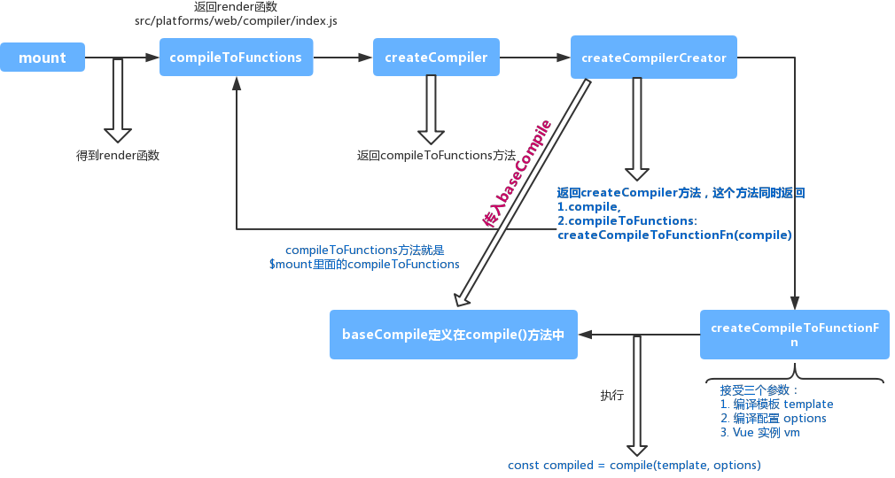

## 关于编译
在`Runtime + Compiler`版本中入口为`src/platforms/web/entry-runtime-with-compiler.js`，编译的入口在`$mount`中定义：
```javascript
const mount = Vue.prototype.$mount
Vue.prototype.$mount = function (
  el?: string | Element,
  hydrating?: boolean
): Component {
  el = el && query(el)

  /* istanbul ignore if */
  if (el === document.body || el === document.documentElement) {
    process.env.NODE_ENV !== 'production' && warn(
      `Do not mount Vue to <html> or <body> - mount to normal elements instead.`
    )
    return this
  }

  const options = this.$options
  // resolve template/el and convert to render function
  if (!options.render) {
    let template = options.template
    if (template) {
      if (typeof template === 'string') {
        if (template.charAt(0) === '#') {
          template = idToTemplate(template)
          /* istanbul ignore if */
          if (process.env.NODE_ENV !== 'production' && !template) {
            warn(
              `Template element not found or is empty: ${options.template}`,
              this
            )
          }
        }
      } else if (template.nodeType) {
        template = template.innerHTML
      } else {
        if (process.env.NODE_ENV !== 'production') {
          warn('invalid template option:' + template, this)
        }
        return this
      }
    } else if (el) {
      template = getOuterHTML(el)
    }
    if (template) {
      /* istanbul ignore if */
      if (process.env.NODE_ENV !== 'production' && config.performance && mark) {
        mark('compile')
      }

      const { render, staticRenderFns } = compileToFunctions(template, {
        shouldDecodeNewlines,
        shouldDecodeNewlinesForHref,
        delimiters: options.delimiters,
        comments: options.comments
      }, this)
      options.render = render
      options.staticRenderFns = staticRenderFns

      /* istanbul ignore if */
      if (process.env.NODE_ENV !== 'production' && config.performance && mark) {
        mark('compile end')
        measure(`vue ${this._name} compile`, 'compile', 'compile end')
      }
    }
  }
  return mount.call(this, el, hydrating)
}
```
不管是`template`还是`render`最终都会处理成`render`而处理逻辑就是`compileToFunctions`方法：
```javascript
const { render, staticRenderFns } = compileToFunctions(template, {
  shouldDecodeNewlines,
  shouldDecodeNewlinesForHref,
  delimiters: options.delimiters,
  comments: options.comments
}, this)
```
`compileToFunctions`方法定义在`src/platforms/web/compiler/index.js`代码：
```javascript
import { baseOptions } from './options'
import { createCompiler } from 'compiler/index'

const { compile, compileToFunctions } = createCompiler(baseOptions)

export { compile, compileToFunctions }
```
`compileToFunctions`方法又是从`createCompiler(baseOptions)`中返回，定义在`src/compiler/index`中，代码如下：
```javascript
import { parse } from './parser/index'
import { optimize } from './optimizer'
import { generate } from './codegen/index'
import { createCompilerCreator } from './create-compiler'

// `createCompilerCreator` allows creating compilers that use alternative
// parser/optimizer/codegen, e.g the SSR optimizing compiler.
// Here we just export a default compiler using the default parts.
export const createCompiler = createCompilerCreator(function baseCompile (
  template: string,
  options: CompilerOptions
): CompiledResult {
  const ast = parse(template.trim(), options)
  if (options.optimize !== false) {
    optimize(ast, options)
  }
  const code = generate(ast, options)
  return {
    ast,
    render: code.render,
    staticRenderFns: code.staticRenderFns
  }
})
```
`createCompiler`方法又是从`createCompilerCreator`中返回，定义在`src/compiler/create-compiler`中，代码如下：
```javascript
export function createCompilerCreator (baseCompile: Function): Function {
  return function createCompiler (baseOptions: CompilerOptions) {
    function compile (
      template: string,
      options?: CompilerOptions
    ): CompiledResult {
      const finalOptions = Object.create(baseOptions)
      const errors = []
      const tips = []

      let warn = (msg, range, tip) => {
        (tip ? tips : errors).push(msg)
      }

      if (options) {
        if (process.env.NODE_ENV !== 'production' && options.outputSourceRange) {
          // $flow-disable-line
          const leadingSpaceLength = template.match(/^\s*/)[0].length

          warn = (msg, range, tip) => {
            const data: WarningMessage = { msg }
            if (range) {
              if (range.start != null) {
                data.start = range.start + leadingSpaceLength
              }
              if (range.end != null) {
                data.end = range.end + leadingSpaceLength
              }
            }
            (tip ? tips : errors).push(data)
          }
        }
        // merge custom modules
        if (options.modules) {
          finalOptions.modules =
            (baseOptions.modules || []).concat(options.modules)
        }
        // merge custom directives
        if (options.directives) {
          finalOptions.directives = extend(
            Object.create(baseOptions.directives || null),
            options.directives
          )
        }
        // copy other options
        for (const key in options) {
          if (key !== 'modules' && key !== 'directives') {
            finalOptions[key] = options[key]
          }
        }
      }

      finalOptions.warn = warn

      const compiled = baseCompile(template.trim(), finalOptions)
      if (process.env.NODE_ENV !== 'production') {
        detectErrors(compiled.ast, warn)
      }
      compiled.errors = errors
      compiled.tips = tips
      return compiled
    }

    return {
      compile,
      compileToFunctions: createCompileToFunctionFn(compile)
    }
  }
}

```
`createCompilerCreator`返回函数`createCompiler`，该函数返回
```javascript
return {
  compile,
  compileToFunctions: createCompileToFunctionFn(compile)
}
```
`compileToFunctions`方法就是当Vue `$mount`的时候调用的
```javascript
const { render, staticRenderFns } = compileToFunctions(template, {
  shouldDecodeNewlines,
  shouldDecodeNewlinesForHref,
  delimiters: options.delimiters,
  comments: options.comments
}, this)
```
`compileToFunctions`方法。
`createCompileToFunctionFn` 方法，它的定义在 `src/compiler/to-function/js` 中：
```javascript
export function createCompileToFunctionFn (compile: Function): Function {
  const cache = Object.create(null)

  return function compileToFunctions (
    template: string,
    options?: CompilerOptions,
    vm?: Component
  ): CompiledFunctionResult {
    options = extend({}, options)
    const warn = options.warn || baseWarn
    delete options.warn

    /* istanbul ignore if */
    if (process.env.NODE_ENV !== 'production') {
      // detect possible CSP restriction
      try {
        new Function('return 1')
      } catch (e) {
        if (e.toString().match(/unsafe-eval|CSP/)) {
          warn(
            'It seems you are using the standalone build of Vue.js in an ' +
            'environment with Content Security Policy that prohibits unsafe-eval. ' +
            'The template compiler cannot work in this environment. Consider ' +
            'relaxing the policy to allow unsafe-eval or pre-compiling your ' +
            'templates into render functions.'
          )
        }
      }
    }

    // check cache
    const key = options.delimiters
      ? String(options.delimiters) + template
      : template
    if (cache[key]) {
      return cache[key]
    }

    // compile
    const compiled = compile(template, options)

    // check compilation errors/tips
    if (process.env.NODE_ENV !== 'production') {
      if (compiled.errors && compiled.errors.length) {
        warn(
          `Error compiling template:\n\n${template}\n\n` +
          compiled.errors.map(e => `- ${e}`).join('\n') + '\n',
          vm
        )
      }
      if (compiled.tips && compiled.tips.length) {
        compiled.tips.forEach(msg => tip(msg, vm))
      }
    }

    // turn code into functions
    const res = {}
    const fnGenErrors = []
    res.render = createFunction(compiled.render, fnGenErrors)
    res.staticRenderFns = compiled.staticRenderFns.map(code => {
      return createFunction(code, fnGenErrors)
    })

    // check function generation errors.
    // this should only happen if there is a bug in the compiler itself.
    // mostly for codegen development use
    /* istanbul ignore if */
    if (process.env.NODE_ENV !== 'production') {
      if ((!compiled.errors || !compiled.errors.length) && fnGenErrors.length) {
        warn(
          `Failed to generate render function:\n\n` +
          fnGenErrors.map(({ err, code }) => `${err.toString()} in\n\n${code}\n`).join('\n'),
          vm
        )
      }
    }

    return (cache[key] = res)
  }
}
```
核心代码是`const compiled = compile(template, options)`其中`compile()`方法是在`createCompilerCreator()`方法返回的函数`createCompiler()`中定义，在
```javascript
return {
  compile,
  compileToFunctions: createCompileToFunctionFn(compile)
}
```
此时传入的。

## 接着来看compile函数的定义
```javascript
function compile (
  template: string,
  options?: CompilerOptions
): CompiledResult {
  const finalOptions = Object.create(baseOptions)
  const errors = []
  const tips = []
  finalOptions.warn = (msg, tip) => {
    (tip ? tips : errors).push(msg)
  }

  if (options) {
    // merge custom modules
    if (options.modules) {
      finalOptions.modules =
        (baseOptions.modules || []).concat(options.modules)
    }
    // merge custom directives
    if (options.directives) {
      finalOptions.directives = extend(
        Object.create(baseOptions.directives || null),
        options.directives
      )
    }
    // copy other options
    for (const key in options) {
      if (key !== 'modules' && key !== 'directives') {
        finalOptions[key] = options[key]
      }
    }
  }

  const compiled = baseCompile(template, finalOptions)
  if (process.env.NODE_ENV !== 'production') {
    errors.push.apply(errors, detectErrors(compiled.ast))
  }
  compiled.errors = errors
  compiled.tips = tips
  return compiled
}
```
`compile` 函数执行的逻辑是先处理配置参数，然后真正的编译是`const compiled = baseCompile(template, finalOptions)`
最终在编译入口主要做了这么几件事
  * 解析模板字符串生成 AST
    `const ast = parse(template.trim(), options)`

  * 优化语法树
    `optimize(ast, options)`

  * 生成代码
    `const code = generate(ast, options)`


[
