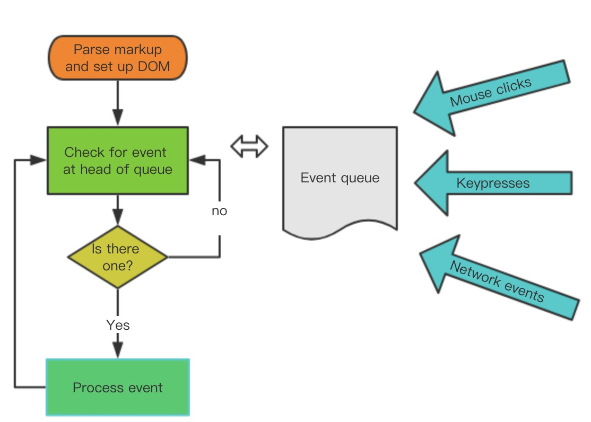

## js为什么是单线程
js在设计之初就是单线程的，因为如果是多线程的话如果一个线程添加`DOM`另一个线程删除`DOM`此时浏览器将不知道以哪个线程为准。在HTML5中，推出了web worker标准，允许JavaScript脚本创建多个线程，但是子线程完全受主线程的控制，且不得操作DOM，所以也是没有违背JavaScript单线程的本质。
**这么设计的目的是为了减少复杂性**

## 异步
由于`javascript`是单线程的所以，所以任务需要依次执行，这样的话如果前面的任务卡死，后面的任务将无法执行。所以`javascript`采取了事件循环(event loop)处理异步操作的策略。

## 任务队列

（1）所有同步任务都在主线程上执行，形成一个执行栈（execution context stack）。

（2）主线程之外，还存在一个"任务队列"（task queue）。只要异步任务有了运行结果，就在"任务队列"之中放置一个事件（回调函数）。

（3）一旦"执行栈"中的所有同步任务执行完毕，系统就会读取"任务队列"，看看里面有哪些事件。那些对应的异步任务，于是结束等待状态，进入执行栈，开始执行。

（4）主线程不断重复上面的第三步。

从第二三步可以看出，主线程执行异步任务，就是执行异步函数的回调函数。主线程执行任务队列中的回调函数执行先进先出的策略。

